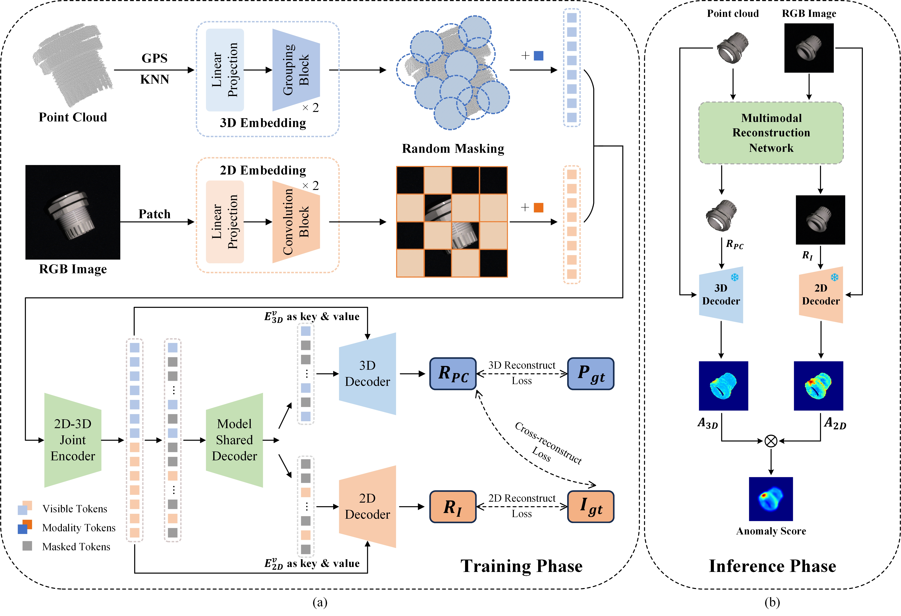
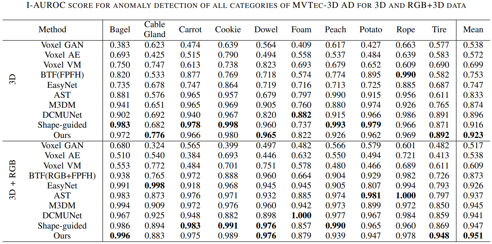
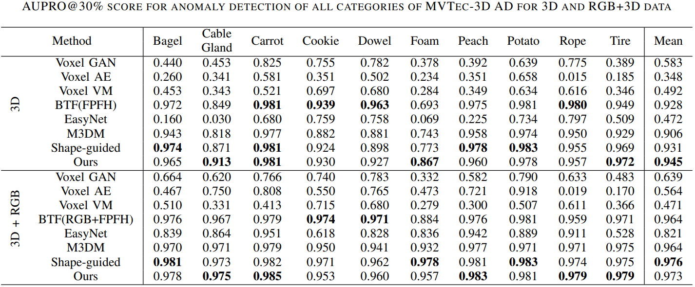
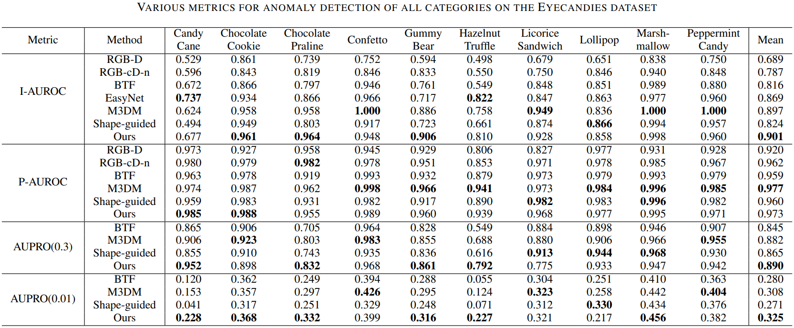

# DBMRNet: Dual-Branch Self-Supervised Masked Reconstruction Network for Multimodal Industrial Anomaly Detection


## 🌈**Our code will be released as open-source soon.**

> ___
>
> **Abstract:** Industrial anomaly detection is a challenging computer vision task, where two-dimensional based anomaly detection methods have been extensively studied. However, multimodal anomaly detection based on 2D images and 3D point clouds requires further exploration. Recently, many unsupervised anomaly detection methods based on feature memory banks have been proposed. But, most of these methods use pre-trained models as feature extractors, which hinders their deployment in resource-constrained environments, and the large memory banks increase the model inference time. To address these issues, this article proposes a multimodal reconstruction framework for self-supervised learning, which consists of two hierarchical embedding modules, a joint encoder, and a joint decoder with modality-shared and modality-specific components. To further enhance cross-modal interaction, we introduce two cross-modal strategies to improve 3D point cloud representation, including a local alignment attention mechanism for semantic alignment between images and point clouds, and a cross-modal reconstruction loss to impose geometric consistency constraints between 2D and 3D data. During the inference phase, we use the framework to reconstruct RGB images and 3D point clouds, and extract features from both 2D images and 3D point clouds. Extensive experiments on the MVTec 3D-AD and Eyescandies datasets show that the proposed method outperforms previous state-of-the-art (SoTA) methods in 2D-3D multimodal industrial anomaly detection, effectively reducing the computational resource consumption of the model and enhancing its real-time performance.

#### Framework




## 🚀Getting Started

#### Setup

We implement this repo with the following environment:

- Ubuntu 18.04.6 LTS
- Python 3.10.8
- Pytorch 1.13.1
- CUDA 11.6

Install the other package via:

```python
pip install -r requirement.txt

# install knn_cuda
pip install --upgrade https://github.com/unlimblue/KNN_CUDA/releases/download/0.2/KNN_CUDA-0.2-py3-none-any.whl

# install pointnet2_ops_lib
pip install "git+git://github.com/erikwijmans/Pointnet2_PyTorch.git#egg=pointnet2_ops&subdirectory=pointnet2_ops_lib"

```

#### Dataset

**MVTec 3D AD download**

- The `MVTec-3D AD` dataset can be download from the [Official Website of MVTec-3D AD](https://www.mvtec.com/company/research/datasets/mvtec-3d-ad).

**eyecandies download**

- The `Eyecandies` dataset can be download from the [Official Website of Eyecandies](https://eyecan-ai.github.io/eyecandies/).

After download, put the dataset in `datasets` folder.

**dataset pre-processing**

```python
python /utils/preprocessing_mvtec3d.py --dataset_path datasets/mvtec_3d/ 

python /utils/preprocessing_eyecandies.py --dataset_path datasets/Eyecandies/ --target_dir datasets/Eyecandies_preprocessed
```


## Quantitative results








## 🍀Citation
If you find this repository useful for your research, please use the following.

```bibtex
@article{
	
}
```


## 🤝Acknowledgments

Some parts of the code are adapted from the following excellent works:

- [MAE](https://github.com/facebookresearch/mae)
- [PointMAE](https://github.com/Pang-Yatian/Point-MAE)

We sincerely thank the authors for their contributions.

```bibtex
@inproceedings{he2022masked,
  title={Masked autoencoders are scalable vision learners},
  author={He, Kaiming and Chen, Xinlei and Xie, Saining and Li, Yanghao and Doll{\'a}r, Piotr and Girshick, Ross},
  booktitle={Proceedings of the IEEE/CVF conference on computer vision and pattern recognition},
  pages={16000--16009},
  year={2022}
}

@inproceedings{pang2022masked,
  title={Masked autoencoders for point cloud self-supervised learning},
  author={Pang, Yatian and Wang, Wenxiao and Tay, Francis EH and Liu, Wei and Tian, Yonghong and Yuan, Li},
  booktitle={European conference on computer vision},
  pages={604--621},
  year={2022},
  organization={Springer}
}
```
